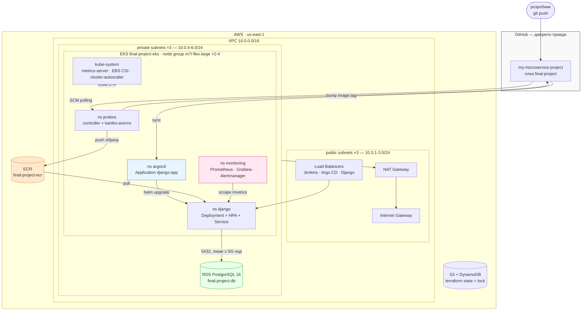
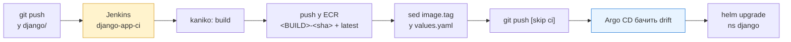
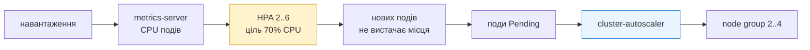

# Фінальний проєкт — DevOps-платформа в AWS

Уся інфраструктура описана в Terraform: мережа, кластер Kubernetes, реєстр образів,
база даних, CI, CD і моніторинг. Django-застосунок збирається Jenkins-ом усередині
кластера, публікується в ECR і розгортається Argo CD за GitOps-підходом. Метрики
застосунку і кластера збирає Prometheus, показує Grafana. Масштабування — на двох
рівнях: HPA додає поди, Cluster Autoscaler додає ноди.

## Архітектура



| Компонент | Модуль | Що робить |
|-----------|--------|-----------|
| S3 + DynamoDB | `modules/s3-backend` | віддалений стейт із версіюванням, шифруванням і локами |
| VPC | `modules/vpc` | 3 публічні + 3 приватні підмережі у трьох AZ, IGW, один NAT |
| ECR | `modules/ecr` | репозиторій образів, сканування при push, lifecycle-політика |
| EKS | `modules/eks` | кластер, node group, OIDC/IRSA, EBS CSI, metrics-server, gp3 StorageClass, cluster-autoscaler |
| RDS | `modules/rds` | PostgreSQL 16 у приватних підмережах; `use_aurora = true` перемикає на Aurora-кластер |
| Jenkins | `modules/jenkins` | Helm-реліз, JCasC-джоба, IRSA для kaniko |
| Argo CD | `modules/argo_cd` | Helm-реліз + app-of-apps чарт (Application, Repository) |
| Monitoring | `modules/monitoring` | kube-prometheus-stack: Prometheus, Grafana, Alertmanager, exporters, дашборд і алерти застосунку |

Версії чартів: Jenkins `5.9.45`, Argo CD `10.2.1`, kube-prometheus-stack `88.0.1`,
cluster-autoscaler `9.59.0`.

## Структура репозиторію

```
.
├── main.tf                  # модулі + ns django і Secret з креденшелами RDS
├── backend.tf               # S3 + DynamoDB бекенд (вмикається після bootstrap)
├── providers.tf variables.tf outputs.tf terraform.tfvars.example
│
├── modules/
│   ├── s3-backend/  vpc/  ecr/
│   ├── eks/                 # + oidc, ebs csi, metrics-server, storage class, autoscaler
│   ├── rds/                 # rds.tf або aurora.tf — залежно від use_aurora
│   ├── jenkins/  argo_cd/
│   └── monitoring/          # values.yaml + dashboards/django-app.json
│
├── charts/django-app/       # чарт, який синхронізує Argo CD
│   ├── templates/           # deployment, service, configmap, secret, hpa,
│   │                        # servicemonitor, postgres (вимкнений)
│   └── values.yaml          # image.repository + image.tag — контракт із Jenkins
│
└── django/
    ├── myproject/           # /, /healthz/, /load/, /metrics
    ├── Dockerfile  entrypoint.sh  Jenkinsfile  requirements.txt
    └── docker-compose.yaml  # локальний запуск із власним Postgres
```

## Передумови

- AWS CLI з робочими креденшелами — перевірка: `aws sts get-caller-identity`
- Terraform ≥ 1.5, kubectl, helm
- GitHub PAT зі скоупом `repo` (Jenkins пушить оновлений `image.tag`)

```bash
export TF_VAR_github_token=ghp_xxxxxxxxxxxx
export TF_VAR_grafana_admin_password='...'     # опційно, дефолт admin123
export TF_VAR_jenkins_admin_password='...'     # опційно, дефолт admin123
```

## Розгортання

### 1. Bootstrap бекенду

Модуль `s3_backend` не може зберігати власний стейт у бакеті, якого ще немає:

```bash
terraform init
terraform apply -target=module.s3_backend
# розкоментувати блок backend "s3" у backend.tf
terraform init -migrate-state
```

### 2. Основний apply

Провайдери `helm` і `kubernetes` налаштовуються з даних кластера, якого на першому
проході ще не існує, тому apply у дві фази:

```bash
terraform apply -target=module.vpc -target=module.eks -target=module.ecr   # ~15 хв
terraform apply                                                           # RDS, monitoring, Jenkins, Argo CD

aws eks update-kubeconfig --region us-east-1 --name final-project-eks
kubectl get nodes
```

### 3. Один раз вписати URL ECR у чарт

З нього pipeline бере реєстр і регіон:

```bash
terraform output -raw ecr_repository_url
# підставити у charts/django-app/values.yaml → image.repository
git commit -am "chore: set ECR repository URL" && git push origin final-project
```

Поки Jenkins не зібрав перший образ, поди застосунку будуть у `ImagePullBackOff`:
у Git лежить `image.tag: "latest"`, якого в ECR ще немає.

## Перевірка доступності

```bash
kubectl get all -n jenkins
kubectl get all -n argocd
kubectl get all -n monitoring
kubectl get all -n django
```

| Сервіс | Команда | Адреса |
|--------|---------|--------|
| Jenkins | `kubectl port-forward svc/jenkins 8080:8080 -n jenkins` | http://localhost:8080 |
| Argo CD | `kubectl port-forward svc/argocd-server 8081:443 -n argocd` | https://localhost:8081 |
| Grafana | `kubectl port-forward svc/grafana 3000:80 -n monitoring` | http://localhost:3000 |
| Prometheus | `kubectl port-forward svc/kube-prometheus-stack-prometheus 9090:9090 -n monitoring` | http://localhost:9090 |

Jenkins і Argo CD додатково опубліковані через LoadBalancer, Grafana — ні
(`grafana_service_type = "ClusterIP"`, щоб не платити за третій ELB).

```bash
terraform output -raw jenkins_admin_password              # логін admin
terraform output -raw argocd_initial_admin_password       # логін admin
terraform output -raw grafana_admin_password              # логін admin
```

## CI/CD



Jenkins не деплоїть у кластер — він лише змінює тег образу в Git. Стан кластера
визначає виключно Git, а зводить їх Argo CD (`automated`, `prune`, `selfHeal`).

Тег містить номер білда і хеш коміта: з незмінним `latest` файл у Git не змінювався
б і Argo CD не бачив би розбіжності. Коміт від Jenkins містить `[skip ci]`, інакше
він запускав би наступний білд по колу.

### Jenkins

Джоба `django-app-ci` і credential `github-pat` створюються з Terraform, у UI
налаштовувати нічого не треба:

```bash
terraform output jenkins_github_credentials_configured    # true
```

Запустити: **django-app-ci → Build Now** (або дочекатися polling раз на 2 хвилини).

```bash
kubectl -n jenkins get pods -w        # агент-под піднімається на час білда

aws ecr describe-images --repository-name final-project-ecr --region us-east-1 \
  --query 'sort_by(imageDetails,&imagePushedAt)[-1].imageTags'

git pull origin final-project
grep -A2 '^image:' charts/django-app/values.yaml
```

### Argo CD

```bash
kubectl -n argocd get application django-app \
  -o jsonpath='{.status.sync.status} {.status.health.status}{"\n"}'

# прискорити (за замовчуванням опитування раз на ~3 хвилини)
kubectl -n argocd exec deploy/argocd-server -- argocd app sync django-app --core
```

GitOps у дії — ручна зміна відкочується до стану з Git за секунди:

```bash
kubectl -n django set image deploy/django-app-django django=nginx:alpine
kubectl -n django get deploy django-app-django \
  -o jsonpath='{.spec.template.spec.containers[0].image}{"\n"}'   # знову тег із Git
```

### Застосунок

```bash
EXTERNAL=$(kubectl -n django get svc django-app-django \
  -o jsonpath='{.status.loadBalancer.ingress[0].hostname}')

curl -s "http://$EXTERNAL/"          # {"status":"ok","app":"django-app","pod":"..."}
curl -s "http://$EXTERNAL/healthz/"  # SELECT version() — доводить, що працює саме RDS
curl -s "http://$EXTERNAL/metrics" | head
```

## Моніторинг і метрики

`modules/monitoring` ставить kube-prometheus-stack: Prometheus (PVC gp3, retention
3 дні), Grafana, Alertmanager, node-exporter і kube-state-metrics.

**Метрики застосунку.** Django експортує `/metrics` через `django-prometheus`.
Чарт створює `ServiceMonitor`, і Prometheus Operator сам додає ціль у конфіг — саме
тому monitoring розгортається до Argo CD: CRD має існувати раніше за чарт.

**Дашборд.** `modules/monitoring/dashboards/django-app.json` лежить у Git, Terraform
кладе його у ConfigMap із лейблом `grafana_dashboard=1`, sidecar Grafana підхоплює.
Панелі: RPS за view, частка 5xx, p50/p95/p99, з'єднання до БД, HPA
(current/desired/min/max), CPU подів проти цілі HPA, кількість нод і Pending-подів.

```bash
kubectl port-forward svc/grafana 3000:80 -n monitoring
# Dashboards → «Django app — traffic, latency, autoscaling»

kubectl port-forward svc/kube-prometheus-stack-prometheus 9090:9090 -n monitoring
# http://localhost:9090/targets — django-app має бути UP
```

**Алерти** (`additionalPrometheusRulesMap` у `modules/monitoring/values.yaml`):

| Алерт | Умова |
|-------|-------|
| `DjangoAppDown` | жодної живої цілі django протягом 3 хв |
| `DjangoHighErrorRate` | частка 5xx > 5% протягом 5 хв |
| `DjangoHpaMaxedOut` | HPA впирається в `maxReplicas` 10 хв |

## Автомасштабування



- **HPA** (`charts/django-app/templates/hpa.yaml`) — 2..6 подів, ціль 70% CPU від
  `resources.requests.cpu`, дані від metrics-server.
- **Cluster Autoscaler** (`modules/eks/cluster_autoscaler.tf`) — 2..4 ноди,
  auto-discovery за тегами ASG, доступ до AWS через IRSA.

`spec.replicas` у Deployment навмисно не задано: ним керує HPA, і Argo CD не вважає
це розбіжністю з Git.

### Демонстрація

Ендпоінт `/load/` тримає CPU зайнятим задану кількість мілісекунд:

```bash
EXTERNAL=$(kubectl -n django get svc django-app-django \
  -o jsonpath='{.status.loadBalancer.ingress[0].hostname}')

for i in $(seq 1 20); do
  while true; do curl -s "http://$EXTERNAL/load/?ms=500" > /dev/null; done &
done

watch kubectl -n django get hpa,pods
kubectl get nodes -w
kubectl -n kube-system logs -l app.kubernetes.io/name=aws-cluster-autoscaler --tail=50
```

Очікувано: HPA піднімає репліки до 6 → частина подів у `Pending` → cluster-autoscaler
додає ноду → поди стають `Running`. Після `pkill curl` через кілька хвилин репліки і
ноди повертаються назад (`scale-down-unneeded-time = 2m`).

## Безпека

**Мережа.** Ноди і база — лише у приватних підмережах, вихід в інтернет через NAT.
У публічних — тільки IGW, NAT і Load Balancer-и. Назовні опубліковані рівно три
сервіси: Jenkins, Argo CD і застосунок.

**Security Groups.** База не має жодного CIDR-правила: вхід дозволено виключно з
security group нод EKS (`allowed_security_group_ids`), тобто «з кластера», а не «з
підмережі». `publicly_accessible = false`.

**IAM.** Окремі ролі з мінімальними правами:

| Роль | Хто отримує | Права |
|------|-------------|-------|
| `*-cluster-role` | control plane | `AmazonEKSClusterPolicy` |
| `*-node-role` | ноди | worker + CNI + ECR read-only |
| `*-ebs-csi-role` | IRSA `kube-system:ebs-csi-controller-sa` | `AmazonEBSCSIDriverPolicy` |
| `*-agent-ecr-role` | IRSA `jenkins:jenkins-agent` | push/pull лише в один ECR-репозиторій |
| `*-cluster-autoscaler-role` | IRSA `kube-system:cluster-autoscaler` | зміна розміру ASG із тегом цього кластера |

IRSA означає, що в подах немає статичних ключів: токен ServiceAccount обмінюється на
тимчасові креденшели, а trust policy перевіряє конкретні namespace і ServiceAccount.

**Секрети.** Ендпоінт і пароль RDS Terraform кладе у Secret `django/django-db` — у
Git їх немає. PAT для GitHub лежить у Secret із лейблом `jenkins.io/credentials-type`,
звідки його бере плагін `kubernetes-credentials-provider`.

**Шифрування.** Стейт у S3 (AES256, версіювання, публічний доступ заблоковано), диски
RDS і EBS-томи, образи в ECR (AES256) зі скануванням при push.

**Застосунок.** Контейнер працює під непривілейованим користувачем (uid 10001),
`DJANGO_DEBUG=False`, проби б'ють у ендпоінт, який не ходить у базу.

## Видалення

Порядок важливий: спершу те, що створило LoadBalancer-и, інакше `destroy` не зможе
видалити VPC.

```bash
kubectl -n argocd delete application django-app
terraform destroy -target=module.argo_cd -target=module.jenkins -target=module.monitoring
terraform destroy
```

Бекенд зберігає стейт, тому видаляється останнім і в зворотному порядку відносно
bootstrap:

```bash
# закоментувати блок backend "s3" у backend.tf
terraform init -migrate-state          # стейт повертається в локальний файл
terraform destroy -target=module.s3_backend
```

Перевірити, що не залишилось того, що коштує грошей без кластера:

```bash
aws elbv2 describe-load-balancers --query 'LoadBalancers[].LoadBalancerName'
aws elb describe-load-balancers --query 'LoadBalancerDescriptions[].LoadBalancerName'
aws ec2 describe-volumes --filters Name=status,Values=available --query 'Volumes[].VolumeId'
aws rds describe-db-instances --query 'DBInstances[].DBInstanceIdentifier'
```
