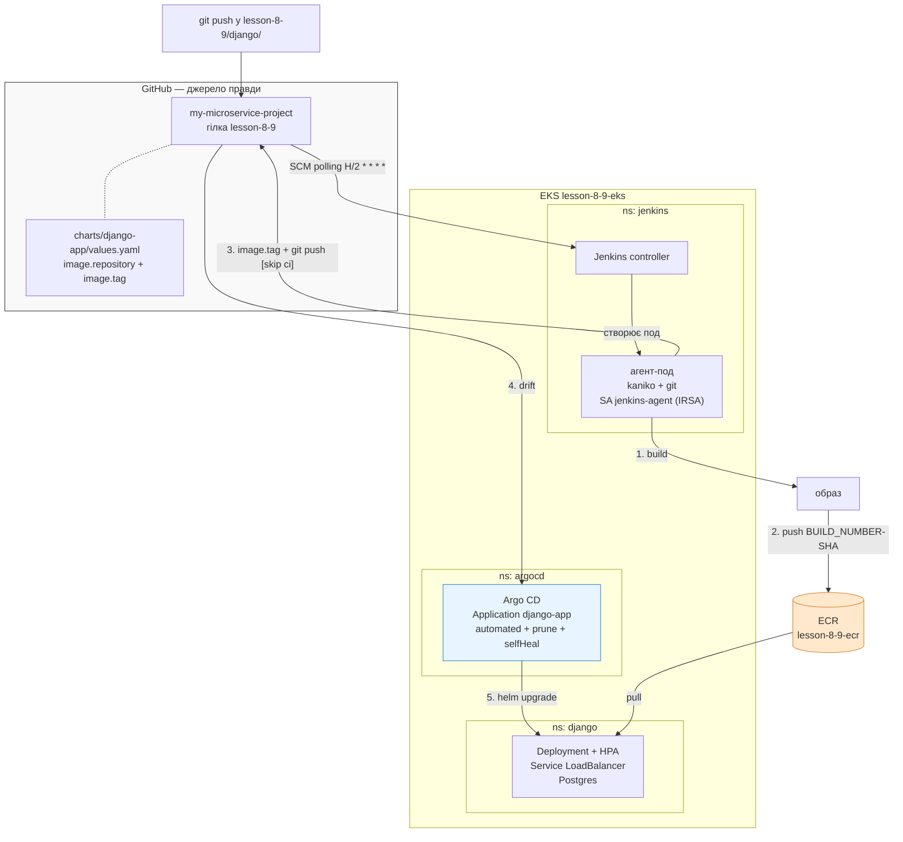

# Теми 8-9 — Jenkins + Argo CD: CI/CD через Terraform і Helm

Django-застосунок збирається Jenkins-ом у Kubernetes, публікується в Amazon ECR і
розгортається в EKS через Argo CD за GitOps-підходом. Jenkins не звертається до
кластера — він лише оновлює тег образу в Git, а Argo CD синхронізує кластер із Git.

## Схема CI/CD



| № | Де | Що |
|---|----|----|
| 1 | kaniko | збирає образ із `django/Dockerfile` без Docker-демона |
| 2 | kaniko | пушить у ECR теги `<BUILD_NUMBER>-<short-sha>` і `latest` |
| 3 | git | переписує `image.tag` у `charts/django-app/values.yaml`, пушить у `lesson-8-9` |
| 4 | Argo CD | бачить розбіжність кластера з Git |
| 5 | Argo CD | `helm upgrade`, поди тягнуть новий образ |

Тег містить номер білда і хеш коміта: з незмінним `latest` файл у Git не змінювався
б і Argo CD не бачив би drift. Коміт від Jenkins містить `[skip ci]`, інакше він
запускав би наступний білд по колу.

## Структура

```
lesson-8-9/
├── main.tf backend.tf providers.tf variables.tf outputs.tf
├── Jenkinsfile
├── django/                  # застосунок + Dockerfile
├── charts/django-app/       # Helm-чарт: deployment, service, configmap, secret, hpa, postgres
└── modules/
    ├── s3-backend/          # S3 + DynamoDB
    ├── vpc/                 # VPC, підмережі, IGW, NAT
    ├── ecr/                 # ECR
    ├── eks/                 # кластер, node group, OIDC, EBS CSI driver, metrics-server
    ├── jenkins/             # Helm-реліз, IRSA для kaniko, gp3 StorageClass
    └── argo_cd/             # Helm-реліз + app-of-apps чарт (Application, Repository)
```

Версії: Kubernetes `1.34`, AMI `AL2023_x86_64_STANDARD`, ноди `m7i-flex.large` × 2
(max 3), Jenkins chart `5.9.45`, Argo CD chart `10.2.1`.

## Передумови

- AWS CLI з робочими креденшелами (`aws sts get-caller-identity`)
- Terraform ≥ 1.5, kubectl, helm
- GitHub PAT зі скоупом `repo`

## 1. Terraform

```bash
export TF_VAR_github_token=ghp_xxxxxxxxxxxx
```

Bootstrap бекенду (один раз):

```bash
cd lesson-8-9
terraform init
terraform apply -target=module.s3_backend
# розкомментувати блок backend "s3" у backend.tf
terraform init -migrate-state
```

Apply у дві фази — провайдери `helm` і `kubernetes` налаштовуються з даних кластера,
якого на першому проході ще не існує:

```bash
terraform apply -target=module.vpc -target=module.eks -target=module.ecr   # ~15 хв
terraform apply                                                           # Jenkins + Argo CD
```

```bash
aws eks update-kubeconfig --region us-east-1 --name lesson-8-9-eks
kubectl get nodes
```

Один раз вписати ECR URL у чарт — з нього pipeline бере реєстр і регіон:

```bash
terraform output -raw ecr_repository_url
# підставити у charts/django-app/values.yaml → image.repository
git commit -am "chore: set ECR repository URL" && git push origin lesson-8-9
```

Виводи:

```bash
terraform output
terraform output -raw jenkins_url
terraform output -raw jenkins_admin_password
terraform output -raw argocd_url
terraform output -raw argocd_initial_admin_password
```

## 2. Перевірка Jenkins job

```bash
terraform output -raw jenkins_url
terraform output -raw jenkins_admin_password    # логін admin
kubectl -n jenkins get svc jenkins -w           # якщо URL порожній
```

Job `django-app-ci` створюється через JCasC, налаштовувати в UI нічого не треба.
Credential `github-pat` теж створює Terraform:

```bash
terraform output jenkins_github_credentials_configured    # true
```

Якщо `false` — додати вручну: **Manage Jenkins → Credentials → System → Global** →
*Username with password*, ID `github-pat`.

Запустити: **django-app-ci → Build Now** (або дочекатися polling).

Очікувані стадії:

```
Checkout                     Image / Region / Commit
Build & push image to ECR    pushing image to ...lesson-8-9-ecr:7-a1b2c3d
Update Helm values in Git    tag: "7-a1b2c3d"
                             Pushed image.tag=7-a1b2c3d to lesson-8-9
```

Агент піднімається як под під час білда:

```bash
kubectl -n jenkins get pods -w
```

Результат поза Jenkins:

```bash
aws ecr describe-images --repository-name lesson-8-9-ecr --region us-east-1 \
  --query 'sort_by(imageDetails,&imagePushedAt)[-1].imageTags'

git pull origin lesson-8-9
git log --oneline -3
grep -A2 '^image:' charts/django-app/values.yaml
```

## 3. Перевірка Argo CD

```bash
terraform output -raw argocd_url
terraform output -raw argocd_initial_admin_password    # логін admin

# або без LoadBalancer
kubectl -n argocd port-forward svc/argocd-server 8080:80
```

Application `django-app` має бути `Synced` / `Healthy`, у дереві ресурсів —
Deployment, Service, ConfigMap, Secret, HPA, Postgres.

```bash
kubectl -n argocd get applications
kubectl -n argocd get application django-app \
  -o jsonpath='{.status.sync.revision}{"\n"}{.status.summary.images}{"\n"}'
```

Синхронізація автоматична, Argo CD опитує Git приблизно раз на 3 хвилини.
Прискорити:

```bash
kubectl -n argocd exec deploy/argocd-server -- argocd app sync django-app --core
```

Перевірити GitOps:

```bash
# selfHeal — ручна зміна відкочується до стану з Git за секунди
kubectl -n django set image deploy/django-app-django django=nginx:alpine
kubectl -n django get deploy django-app-django \
  -o jsonpath='{.spec.template.spec.containers[0].image}{"\n"}'   # знову тег із Git

# rollback — кластер доганяє Git
git revert HEAD && git push origin lesson-8-9
```

Змінювати для цієї перевірки саме `replicas` не має сенсу: у `deployment.yaml`
поле `spec.replicas` не задано, бо ним керує HPA. Чого немає в Git, те Argo CD не
вважає розбіжністю — `kubectl scale` залишиться, а статус буде `Synced`.

Стан застосунку:

```bash
kubectl -n django get hpa      # реальний % у TARGET, не <unknown>
kubectl -n django get pods     # 2+ Running
kubectl -n django get svc      # LoadBalancer має зовнішній адрес

EXTERNAL=$(kubectl -n django get svc django-app-django \
  -o jsonpath='{.status.loadBalancer.ingress[0].hostname}')
curl -s "http://$EXTERNAL/"    # {"status":"ok","app":"django-app","pod":"..."}

# який образ реально в кластері
kubectl -n django get deploy django-app-django \
  -o jsonpath='{.spec.template.spec.containers[0].image}{"\n"}'
```

Якщо HPA показує `<unknown>` — перевірити metrics-server. Він ставиться як
EKS-адон; якщо адон недоступний у регіоні, вимкнути `enable_metrics_server` у
`module.eks` і поставити маніфестом:

```bash
kubectl top nodes
kubectl apply -f https://github.com/kubernetes-sigs/metrics-server/releases/latest/download/components.yaml
```

## 4. Права доступу

Kaniko пушить у ECR через IRSA: `modules/eks/oidc.tf` створює OIDC-провайдера,
`modules/jenkins/irsa.tf` — роль, яку може отримати лише
`system:serviceaccount:jenkins:jenkins-agent`, з правами на один ECR-репозиторій.
Той самий OIDC-провайдер потрібен EBS CSI driver-у.

PAT лежить у Kubernetes Secret із лейблом `jenkins.io/credentials-type`, плагін
`kubernetes-credentials-provider` показує його як credential `github-pat`.

Компроміси демо-кластера:

- `github_token` потрапляє у tfstate (S3, `encrypt = true`)
- `POSTGRES_PASSWORD` і `DJANGO_SECRET_KEY` — у `values.yaml`; для продакшену Sealed Secrets або External Secrets Operator
- пароль Jenkins `admin123` — змінюється через `TF_VAR_jenkins_admin_password`
- Argo CD без TLS (`server.insecure=true`)
- плагіни Jenkins не запінені

## 5. Видалення

Порядок важливий: спершу застосунок і релізи, які створили LoadBalancer-и,
інакше `destroy` не зможе видалити VPC.

```bash
kubectl -n argocd delete application django-app
terraform destroy -target=module.argo_cd -target=module.jenkins
terraform destroy
```
